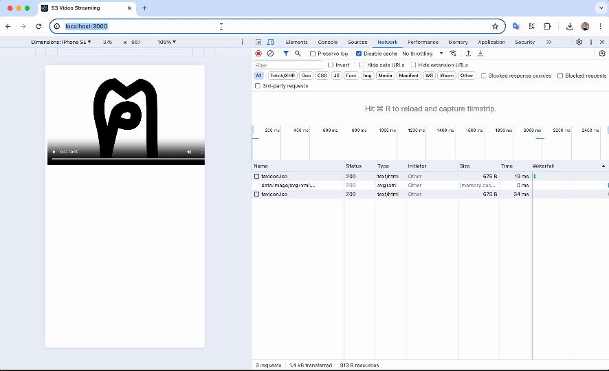

<h1 align='center'>S3 Video Streaming by NestJS</h1>

## Description

This demo how to create a server streaming video from S3 using the [NestJS](https://nestjs.com/) framework.



## Installation

Copy `env.example` to `.env` file and put your S3 values into it.

```bash
$ npm install
```

## Running the app

```bash
# development
$ npm run start

# watch mode
$ npm run start:dev

# production mode
$ npm run start:prod
```

## Test

```bash
# unit tests
$ npm run test

# e2e tests
$ npm run test:e2e

# test coverage
$ npm run test:cov
```

## Author

- Tan Tong ([ozuit](https://github.com/ozuit))
